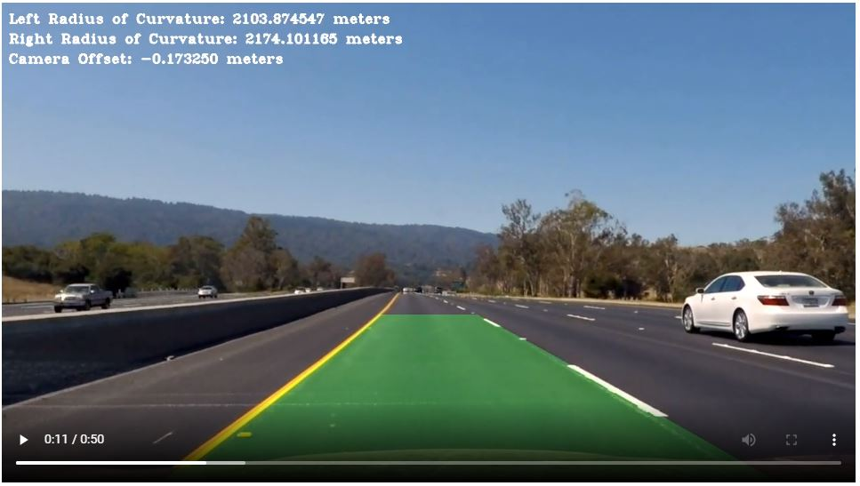
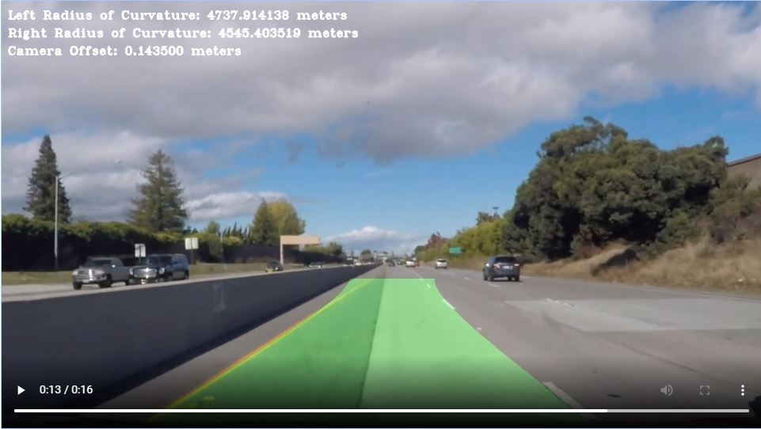

## Writeup Template

### You can use this file as a template for your writeup if you want to submit it as a markdown file, but feel free to use some other method and submit a pdf if you prefer.

---

**Advanced Lane Finding Project**

The goals / steps of this project are the following:

* Compute the camera calibration matrix and distortion coefficients given a set of chessboard images.
* Apply a distortion correction to raw images.
* Use color transforms, gradients, etc., to create a thresholded binary image.
* Apply a perspective transform to rectify binary image ("birds-eye view").
* Detect lane pixels and fit to find the lane boundary.
* Determine the curvature of the lane and vehicle position with respect to center.
* Warp the detected lane boundaries back onto the original image.
* Output visual display of the lane boundaries and numerical estimation of lane curvature and vehicle position.

[//]: # (Image References)

[image1]: ./examples/undistort_output.png "Undistorted"
[image2]: ./test_images/test1.jpg "Road Transformed"
[image3]: ./output_images/threshold.PNG "Combined Threshold"
[image4]: ./output_images/perspective.PNG "Perspective Transform"
[image5]: ./examples/color_fit_lines.jpg "Fit Visual"
[image6]: ./output_images/lanearea.JPG "Lane Area"
[image7]: ./output_images/radius-of-curvature.JPG "Radius of Curvature"
[image8]: ./output_images/normal.JPG "Normal"
[image9]: ./output_images/linefit.JPG "Line Fitting"
[video1]: ./project_video.mp4 "Video"

## [Rubric](https://review.udacity.com/#!/rubrics/571/view) Points

### Here I will consider the rubric points individually and describe how I addressed each point in my implementation.  

---

### Writeup / README

#### 1. Provide a Writeup / README that includes all the rubric points and how you addressed each one.  You can submit your writeup as markdown or pdf.  [Here](https://github.com/udacity/CarND-Advanced-Lane-Lines/blob/master/writeup_template.md) is a template writeup for this project you can use as a guide and a starting point.  

You're reading it!

### Camera Calibration

#### 1. Briefly state how you computed the camera matrix and distortion coefficients. Provide an example of a distortion corrected calibration image.

The code for this step is contained in the first code cell of the IPython notebook located in "./examples/example.ipynb" (or in lines # through # of the file called `some_file.py`).  

I start by preparing "object points", which will be the (x, y, z) coordinates of the chessboard corners in the world. Here I am assuming the chessboard is fixed on the (x, y) plane at z=0, such that the object points are the same for each calibration image.  Thus, `objp` is just a replicated array of coordinates, and `objpoints` will be appended with a copy of it every time I successfully detect all chessboard corners in a test image.  `imgpoints` will be appended with the (x, y) pixel position of each of the corners in the image plane with each successful chessboard detection.  

I then used the output `objpoints` and `imgpoints` to compute the camera calibration and distortion coefficients using the `cv2.calibrateCamera()` function.  I applied this distortion correction to the test image using the `cv2.undistort()` function and obtained this result: 

![alt text][image1]

### Pipeline (single images)

#### 1. Provide an example of a distortion-corrected image.

To demonstrate this step, I will describe how I apply the distortion correction to one of the test images like this one:
![alt text][image2]

#### 2. Describe how (and identify where in your code) you used color transforms, gradients or other methods to create a thresholded binary image.  Provide an example of a binary image result.

I used a combination of color and gradient thresholds to generate a binary image in P4_Advance_Lane_Finding.ipynb.

Converted the warped image to different color spaces and created binary thresholded images which highlight only lane lines and ignore everything else.

Following color channels were used:

'S' Channel from HLS color space, with a minimum threshold = 180 & max threshold = 255
Good: Identifies the white and yellow lane lines,
Bad: Did not pick up 100% of the pixels in either one with the tendency to get distracted by shadows on the road.
'L' Channel from LUV color space, with a min threshold = 225 & max threshold = 255,
Good: Picks up almost all the white lane lines, but
Bad: completely ignores the yellow lines.
'B' channel from the LAB color space, with a min threshold = 155 & max threshold = 200,
Good : Identifies the yellow lines much better than S channel, but
Bad: Completely ignores the white lines.
Created a combined binary threshold based on the above three mentioned binary thresholds.

Here's an example of my output for this step.

![alt text][image3]

#### 3. Describe how (and identify where in your code) you performed a perspective transform and provide an example of a transformed image.

The code for my perspective transform is in 39th code cell in P4_Advance_Lane_Finding.ipynb, which includes a function called transform_perspective() It takes as inputs an image (img) and hardcodes the source (src) and destination (dst) points.

It uses the CV2's getPerspectiveTransform() and warpPerspective() functiions.

I chose the hardcode the source and destination points in the following manner:

    src = np.array([[(width*0.4, height*0.65),
                        (width*0.6, height*0.65),
                        (width, height),
                        (0, height)]], 
                        dtype=np.float32)
    dst = np.array([[0,0], 
                    [img.shape[1], 0], 
                    [img.shape[1], img.shape[0]],
                    [0, img.shape[0]]],
                    dtype = 'float32')
                    
I verified that my perspective transform was working as expected by drawing the src and dst points onto a test image and its warped counterpart to verify that the lines appear parallel in the warped image.

![alt text][image4]

#### 4. Describe how (and identify where in your code) you identified lane-line pixels and fit their positions with a polynomial?

The code snippet is at 30th code cell of P4_Advance_Lane_Finding.ipynb and function is named Fitting Shaded Lines().

Starting with the combined binary image to isolate only the pixels belonging to lane lines, I fit the polynomial to each lane line, as follows:
1. Identified peaks in a histogram of the image to determine location of lane lines.
2. Identified all non-zero pixels around histogram peaks using the numpy function numpy.nonzero().
3. Fitted polynomial to each lane using the numpy's fn. numpy.polyfit().

![alt text][image9]

#### 5. Describe how (and identify where in your code) you calculated the radius of curvature of the lane and the position of the vehicle with respect to center.

The code is in 30th code cell of Advanced Lane Finding.ipynb and function is named def roc_in_meters.
here is the snippet
![alt text][image7]

#### 6. Provide an example image of your result plotted back down onto the road such that the lane area is identified clearly.

Here is an example of my result on a test image:
![alt text][image6]

### Pipeline (video)

#### 1. Provide a link to your final video output.  Your pipeline should perform reasonably well on the entire project video (wobbly lines are ok but no catastrophic failures that would cause the car to drive off the road!).
1. Output: project_video.mp4

2. Output: challenge_video.mp4

### Discussion

#### 1. Briefly discuss any problems / issues you faced in your implementation of this project.  Where will your pipeline likely fail?  What could you do to make it more robust?

Pipeline that I have developed is doing a fairly good job in detecting the lane for given car by taking proper center of it. So far code is running good for ideal conditions where lane lines are well defined.

Above code shows decent result on challenge_result.mp4 video but there are few misses in lane lines specially near shadowed areas.

Code didn't do well on the harder_challenge_video.mp4. Errors coming were like not able to track the path at all.

I think possible way of making it more robust require lot of image processing job to remove noises and extract only those patterns or lane line which are required.
